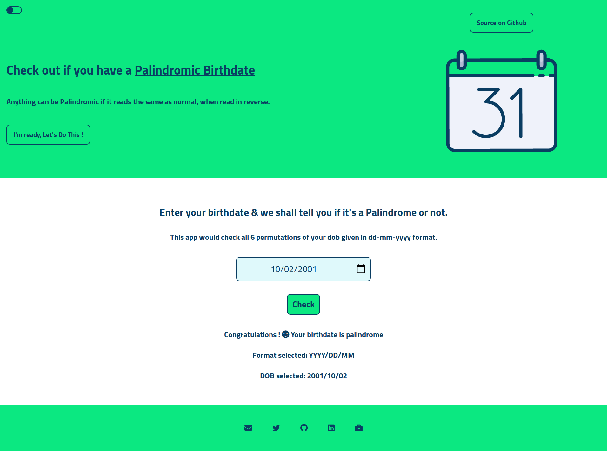
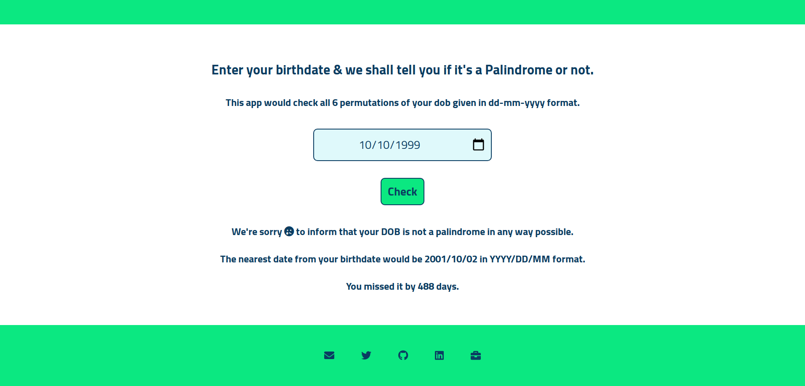

# Palindromic Birthday(PB)

Want to know if your birthdate is a Palindrome ?

You might also ask, what is a Palindrome in first place ?

## Introduction

Simply put, any sequence of characters (maybe alphanumeric or even symbolic) which reads the same when read from backwards as it is from forwards, is considered a Palindrome.

And that is what [Palindromic Birthday](https://palindromic-dob.netlify.app/) is all about. It's a web app that can tell if your date of birth joined as a complete number is a palindrome or not.

## Features

Well, if it's so simple then why do we need Palindromic Birthday, the app ?

Let me tell you that PB can help you find if your birthdate is palindrome or not in these 6 variations -

1. DD/MM/YYYY
1. MM/DD/YYYY
1. MM/YYYY/DD
1. DD/YYYY/MM
1. YYYY/DD/MM
1. YYYY/MM/DD

- So it will check if any of these variations would result in a palindrome.


)

- And if your birthdate is not a palindrome, it even gives you the nearest date to your Birthdate that is a palindrome.



- Also, it has dark theme too, for good old night owls, although I must warn you that it's my first attempt at that, so it might not be what you expect.


**Please Note** -
_The first 2 commits of this repo are marked as unverified. But you don't need to worry about the legitimacy of the code. I personally guarantee it's security. The reason for it being unverified is that, I use a GPG Key on my local Git repos to sign them. And the first 2 commits were initially signed, but due to some reason, I forgot to commit the first time & second commit took me 4-5 hours. So I had to do both of them at the same time. But I quickly realised that my progress wasn't transparent since after initial commit the second one was done in 2 minutes, which contained the core logic for this project and took 4-5 hours in reality. So I had to change the commit date. But there was another issue. Due to some reason, I wasn't able do an to interactive rebase of my Git repo using -_

```
git rebase -i HEAD~2
```

_to get the last 2 commits in history. So I researched and found out that running this filter-branch script could make it work -_

```shell
git filter-branch --env-filter \
    'if [ $GIT_COMMIT = ad4f0da94bf94ba953908a61d76d15c0bead9e6c ]
     then
         export GIT_AUTHOR_DATE="Fri Aug 13 20:38:53 2021 +0530"
         export GIT_COMMITTER_DATE="Fri Aug 13 20:38:53 2021 +0530"
     fi'
```

_This rewrote the commit history to make the initial commit of 5 hours ago, but apparently filter-branch is deprecated now, and can cause additional complexities, which I didn't know about. And hence all the commits at the time(2 at that moment of time) lost their signature._

**_By the way if anyone has a workaround for this, please feel free to open an issue and let me know. Would love to hear it._**
